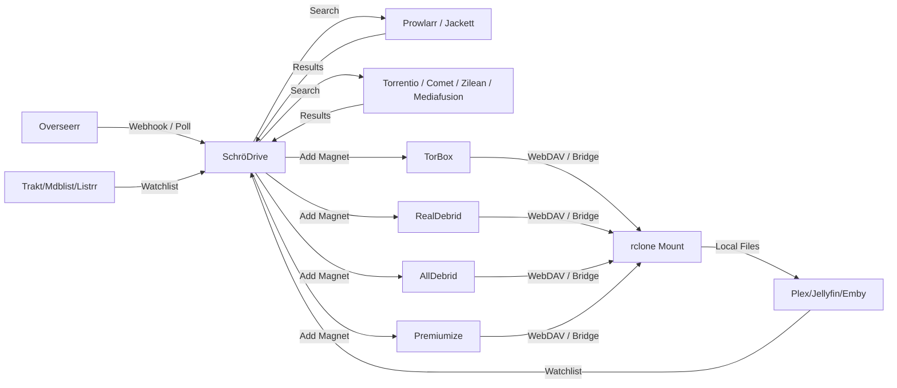
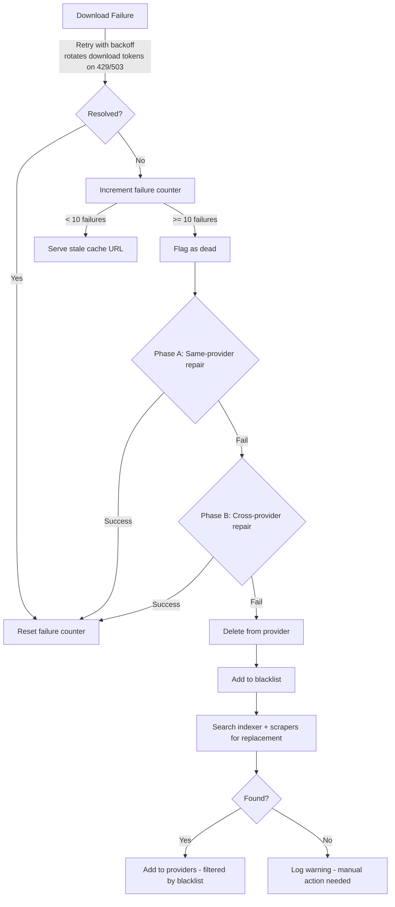

<p align="center">
  <a href="https://github.com/moderniselife/SchroDrive">
    
  </a>
</p>

<h1 align="center">SchröDrive</h1>

<p align="center">
  <strong>The ultimate media automation orchestrator for debrid services.</strong>
  <br />
  <em>Your content exists everywhere and nowhere — until SchröDrive observes it.</em>
</p>

<p align="center">
  <a href="https://github.com/moderniselife/SchroDrive/releases/latest">
    
  </a>
  <a href="https://github.com/moderniselife/SchroDrive/actions">
    
  </a>
  <a href="https://github.com/moderniselife/SchroDrive/blob/main/LICENSE">
    
  </a>
  <a href="https://ghcr.io/moderniselife/schrodrive">
    
  </a>
</p>

<p align="center">
  <a href="#-quick-start">Quick Start</a> •
  <a href="#-features">Features</a> •
  <a href="#-architecture">Architecture</a> •
  <a href="#%EF%B8%8F-configuration">Configuration</a> •
  <a href="#-docker-compose">Docker Compose</a> •
  <a href="#-cli">CLI</a> •
  <a href="#-schrodrive-vs-the-competition">Comparison</a> •
  <a href="#-adding-a-new-provider">Extending</a>
</p>

---

## 🎯 What Is SchröDrive?

SchröDrive seamlessly connects your media request system ([Overseerr](https://overseerr.dev/)) with torrent indexers ([Prowlarr](https://prowlarr.com/) / [Jackett](https://github.com/Jackett/Jackett)) and delivers content to your preferred debrid services — then mounts everything as a virtual drive for your media server.

```
Overseerr → SchröDrive → Prowlarr/Jackett → TorBox / RealDebrid / AllDebrid / Premiumize → rclone Mount → Plex/Jellyfin/Emby
```

**Provider-agnostic by design.** Adding a new debrid provider is a single file — zero changes needed elsewhere.

---

## 🚀 Quick Start

### Docker (recommended)

```bash
docker run -d --name schrodrive \
  -p 8978:8978 \
  -e PROWLARR_URL=http://prowlarr:9696 \
  -e PROWLARR_API_KEY=your_key \
  -e TORBOX_API_KEY=tb_your_key \
  -e RD_ACCESS_TOKEN=your_rd_token \
  -e PROVIDERS=torbox,realdebrid \
  ghcr.io/moderniselife/schrodrive:latest
```

### Docker Compose

```bash
git clone https://github.com/moderniselife/SchroDrive.git
cd SchroDrive
cp .env.example .env     # Edit with your credentials
docker-compose up -d
```

### Bare Metal (Bun)

```bash
git clone https://github.com/moderniselife/SchroDrive.git
cd SchroDrive
bun install
bun run build
bun dist/index.js serve
```

### Verify

```bash
curl http://localhost:8978/health
# → {"ok": true, ...}
```

---

## ✨ Features

### 📺 Multi-Provider Debrid Support

| Provider | Torrents | Web Downloads | Usenet | WebDAV Mount | Bridge | Status |
|----------|:--------:|:------------:|:------:|:------------:|:------:|--------|
| **TorBox** | ✅ | ✅ | ✅ | ✅ | ✅ | Fully supported |
| **RealDebrid** | ✅ | — | — | ✅ | ✅ | Fully supported |
| **AllDebrid** | ✅ | — | — | ✅ | ✅ | Untested ⚠️ |
| **Premiumize** | ✅ | — | — | ✅ | ✅ | Untested ⚠️ |

> [!NOTE]
> **AllDebrid and Premiumize** providers are fully implemented but have not been tested with live accounts yet. If you have an account and want to help test, please open an issue with your findings. We will be testing them ourselves as soon as we get accounts set up.

**Add strategies** — control how content is distributed across providers:

| Strategy | Behaviour | Use Case |
|----------|-----------|----------|
| `all` (default) | Add to **every** configured provider | Maximum redundancy |
| `failover` | Try first provider, fall back on failure | Primary + backup |
| `single` | Only use the first configured provider | Single provider only |

Set via `ADD_STRATEGY` environment variable.

### 🔍 Dual Indexer Support

- **Prowlarr** — `/api/v1/search` integration with full category and indexer ID filtering
- **Jackett** — `/api/v2.0/indexers` integration with equivalent features
- **Auto-detection** — configure one or both; SchröDrive picks the active one
- Intelligent result ranking by seeders (fallback by size)
- Automatic magnet resolution with redirect-following fallback
- **`.torrent` File Support** — indexer results that return `.torrent` download URLs are now supported alongside magnet URIs. All 4 debrid providers (RealDebrid, TorBox, AllDebrid, Premiumize) support torrent file upload.

### 🗂️ Virtual Drive (rclone WebDAV Mounts)

- Mount your debrid library as a local filesystem via rclone
- **WebDAV Bridge** — built-in translation layer that converts debrid API keys into WebDAV endpoints for rclone (no native WebDAV credentials required!)
- **Zurg-compatible organised directories** — automatic media classification into `anime/`, `shows/`, `movies/`, and `__all__/`
- Configurable mount options (VFS cache, permissions, buffer sizes, chunk sizes)
- Works with Plex, Jellyfin, Emby, and any media server that reads local files
- Per-provider mount points under a shared base directory
- **Cloud storage mounts** — mount MEGA, Dropbox, Google Drive, and OneDrive alongside debrid content via rclone

#### Mount Structure

```
/mnt/schrodrive/
├── realdebrid/
│   ├── __all__/         # All torrents (unfiltered)
│   ├── anime/           # CRC hash detected fansub releases
│   ├── shows/           # Episode pattern detected (S01E01, etc.)
│   └── movies/          # Everything else (biggest file only)
├── torbox/
│   ├── __all__/
│   ├── anime/
│   ├── shows/
│   └── movies/
├── ... (other providers)
└── cloud/               # Cloud storage mounts
    ├── mega/
    ├── dropbox/
    ├── gdrive/
    └── onedrive/
```

### 🔗 STRM Short-Code Service (Port 9120)

Stable 16-character alphanumeric URLs that redirect to ephemeral CDN download links. Media player bookmarks never break even when CDN links expire — URLs auto-refresh transparently.

### 🎬 Error Video Fallback

When content is temporarily unavailable (e.g. CDN link expired and refresh failed), a brief error video is served instead of hanging or crashing the media player. This keeps playback graceful during transient outages.

### 🎌 Anime Classification

The organiser now outputs anime to a separate `Anime/` directory (alongside `Movies/` and `TV/`) using CRC hash and fansub pattern detection.

### 🔄 Automation Engine

| Service | Description | Toggle |
|---------|-------------|--------|
| **Webhook** | Instant processing of Overseerr notifications | `RUN_WEBHOOK=true` |
| **API Poller** | Polls Overseerr for approved requests | `RUN_POLLER=true` |
| **Watchlist Poller** | Monitors Plex/Jellyfin/Emby watchlists | `RUN_WATCHLIST_POLLER=true` |
| **Dead Scanner** | Detects stalled/failed torrents, deletes, blacklists, and auto-replaces | `RUN_DEAD_SCANNER_WATCH=true` |
| **Organiser** | Creates symlinked views with TMDB/TVMaze metadata | `RUN_ORGANIZER_WATCH=true` |
| **Auto-Update** | Checks GitHub releases and self-restarts | `AUTO_UPDATE_ENABLED=true` |
| **FUSE Mount** | Mounts debrid content as local drives | `RUN_MOUNT=true` |
| **STRM Redirector** | Stable URLs for media bookmarks (port 9120) | Always on |

### 🖥️ Web GUI (Dashboard)

SchröDrive includes a full **Next.js dashboard** accessible on port 3000 when `RUN_WEB_GUI=true`:

| Page | Description |
|------|-------------|
| **Dashboard** | System overview — provider status, active torrents, mount health, service states |
| **Torrents** | Browse, search, and manage torrents across all configured providers |
| **Files** | Virtual file explorer for mounted debrid content |
| **Search** | Search Prowlarr/Jackett + Stremio scrapers, add torrents directly |
| **Add** | Manually add magnets or torrent hashes to any provider |
| **Mounts** | rclone mount status and health monitoring |
| **Activity** | Real-time feed of system events |
| **Logs** | Live log viewer with SSE streaming |
| **Services** | Toggle and monitor all automation services |
| **Settings** | Runtime configuration editor |

> [!TIP]
> Enable with `RUN_WEB_GUI=true` and `WEB_PORT=3000`. The GUI communicates with the backend API on port 8978 — both run inside the same container.

### 📡 Media Server Integration

| Server | Watchlist | Library Refresh | Status |
|--------|:---------:|:--------------:|--------|
| **Plex** | ✅ | ✅ | Supported |
| **Jellyfin** | ✅ | ✅ | Supported |
| **Emby** | ✅ | ✅ | Supported |

### 🛡️ Resilience & Self-Healing

SchröDrive is designed to handle the real-world chaos of debrid services:

- **Retry-with-backoff** — transient provider errors (423 Locked, 429 Rate Limited, network blips) are retried with exponential backoff before failing
- **Stale-while-locked cache** — expired CDN URLs are kept in a stale cache; when fresh resolution fails, the stale URL is served as a fallback (CDN URLs typically live 6-12 hours past expiry)
- **Mount health monitor** — background process watches rclone log patterns for IO errors and auto-remounts when consecutive failures exceed threshold
- **Stale/Broken FUSE Mount Auto-Recovery** — Automatically detects and recovers from `"Transport endpoint is not connected"` or busy FUSE mounts on startup (often caused by previous container crashes). Unlike legacy systems (like pd_zurg) which permanently lock up the host mount points requiring manual SSH unmounts, SchröDrive forcefully unmounts the broken references and remounts them automatically.
- **Unified Media Server Stream Detection** — Automatically detects active streaming sessions on Plex, Jellyfin, and Emby in parallel. While anyone is watching, background poller queries, watchlist polls, and dead scanner operations are fully paused. This eliminates background API traffic to debrid providers during streaming, preventing rate-limiting, buffering, and mid-stream freezing.
- **Dead torrent auto-lifecycle** — persistent download failures (10+ consecutive) trigger automatic deletion from provider → blacklisting → replacement search via indexer
- **Persistent blacklist** — dead torrent names are stored on disk and checked before re-adding, preventing re-download of known broken content
- **Adaptive rate limiting** with exponential backoff and per-provider tracking
- **Response caching** — stale data served during rate limit windows
- **Duplicate detection** — bi-directional title matching across ALL providers before adding
- **Stale symlink pruning** — automatic cleanup of dead symlinks on every organiser pass
- **Plan limitation detection** — graceful degradation when API limits are hit (e.g. TorBox free tier)

### 🔑 Multi-Token Download Bypass

Inspired by [Zurg's](https://github.com/debridmediamanager/zurg-testing) `download_tokens` feature, SchröDrive supports **multiple debrid account tokens** for download and streaming operations. This lets you scale bandwidth beyond a single account's limits and bypass rate limits.

**How it works:**

- Your **primary token** manages content (adding, listing, and deleting torrents)
- **Download tokens** are used exclusively for download/streaming operations
- When a download token hits bandwidth limits (HTTP 503) or rate limits (HTTP 429), SchröDrive automatically **marks that token as limited** (for 24 hours on 503, or 1 hour on 429) and **rotates** to the next available token
- **Cool rate-limit bypass trick**: Since download tokens represent separate accounts/subscriptions, a 429/rate-limit error on a rotated download token **does not** trigger global provider rate limiting. This allows SchröDrive to immediately switch to another healthy token/account to continue serving streams without interruption!
- All tokens **auto-reset daily at midnight** (configurable timezone)
- Works with **ALL providers**: RealDebrid, TorBox, AllDebrid, and Premiumize

**Environment variables:**

| Variable | Default | Description |
|----------|---------|-------------|
| `RD_DOWNLOAD_TOKENS` | — | Comma-separated list of additional RealDebrid API tokens for downloads |
| `TORBOX_DOWNLOAD_TOKENS` | — | Comma-separated list of additional TorBox API keys for downloads |
| `AD_DOWNLOAD_TOKENS` | — | Comma-separated list of additional AllDebrid API keys for downloads |
| `PM_DOWNLOAD_TOKENS` | — | Comma-separated list of additional Premiumize API keys for downloads |
| `TOKEN_RESET_TIMEZONE` | `Australia/Sydney` | Timezone for the daily token reset schedule |

**Example configuration:**

```env
# Primary token manages content (add/list/delete)
RD_ACCESS_TOKEN=primary_token

# Additional tokens rotate for downloads when bandwidth/rate limits are hit
RD_DOWNLOAD_TOKENS=token2,token3
```

**Monitoring:** Use `GET /api/tokens` to view the status of all tokens — including which are active, exhausted, or cooling down.

> [!TIP]
> You only need download tokens if you're hitting bandwidth caps. A single primary token handles everything by default.

### 🛡️ Intelligent Rate Limiting

SchröDrive implements **provider-specific rate limiting** that goes beyond simple backoff:

- **Respects `Retry-After` headers** — when a provider returns rate limit responses, SchröDrive honours the exact cooldown period
- **Parses provider responses** — understands provider-specific messages (e.g. TorBox's `"60 per hour"`) and calculates exact wait times
- **Exponential backoff** — `60s → 120s → 240s → 480s → 900s` (capped at 15 minutes)
- **Backoff-aware recovery** — successful requests during a backoff window don't prematurely clear the rate limit; the full cooldown is always respected
- **HTTP 451 auto-blacklisting** — torrents that receive `451 Unavailable For Legal Reasons` are automatically blacklisted to prevent repeated futile requests

### 💀 Dead Torrent Detection & Repair

SchröDrive proactively detects and recovers from dead torrents through a **3-phase recovery** process:

**Explicit status detection** — the dead scanner checks for provider-specific failure states:

- RealDebrid: `magnet_error`, `error`, `virus`, `dead`, `compressing_error`
- Other providers: equivalent error/failure statuses

**3-phase recovery pipeline:**

1. **Phase A: Same-provider repair** — attempts to repair the torrent on the same debrid provider (re-add the magnet hash)
2. **Phase B: Cross-provider repair** — if the same provider can't recover it, the torrent is attempted on other configured providers
3. **Phase C: Delete + replace** — if repair fails entirely, the torrent is deleted, blacklisted, and a replacement search is triggered via indexers and scrapers

**Pre-emptive repair** — SchröDrive monitors for **stalling torrents** (configurable idle threshold) and initiates repair *before* they're flagged as dead, minimising downtime.

> [!NOTE]
> See the [Dead Torrent Lifecycle](#dead-torrent-lifecycle) diagram in the Architecture section for a visual overview of this process.

---

## 🏆 SchröDrive vs the Alternatives

> [!NOTE]
> This comparison is based on each project's public documentation at time of writing (June 2026). If anything is inaccurate, please open an issue and we'll correct it immediately.

### At a Glance

| | SchröDrive | pd_zurg | Zurg | Riven |
|---|:---:|:---:|:---:|:---:|
| **Status** | ✅ Active | ⛔ Deprecated | ✅ Active (beta) | ✅ Active |
| **Scope** | Full automation | All-in-one wrapper | WebDAV server only | Full media automation |
| **Source** | Open (MIT) | Open (archived) | Closed (sponsors) | Open (GPLv3) |

### Provider Support

| Provider | SchröDrive | pd_zurg | Zurg | Riven |
|----------|:----------:|:-------:|:----:|:-----:|
| **RealDebrid** | ✅ | ✅ | ✅ | ✅ |
| **TorBox** | ✅ | — | — | ✅ |
| **AllDebrid** | ✅ ⚠️ | ✅ | — | ✅ |
| **Premiumize** | ✅ ⚠️ | — | — | — |
| **Provider redundancy** | ✅ All/Failover/Single | — | — | — |

### Integrations

| Feature | SchröDrive | pd_zurg | Zurg | Riven |
|---------|:----------:|:-------:|:----:|:-----:|
| **Overseerr** | ✅ Webhook + Poller | ✅ via plex_debrid | — | ✅ |
| **Prowlarr** | ✅ | ✅ via plex_debrid | — | ✅ |
| **Jackett** | ✅ | ✅ via plex_debrid | — | ✅ |
| **Plex** | ✅ Watchlist + Refresh | ✅ Watchlist | ✅ | ✅ Watchlist + Refresh |
| **Jellyfin** | ✅ Watchlist + Refresh | — | ✅ | ✅ Watchlist + Refresh |
| **Emby** | ✅ Watchlist + Refresh | — | — | ✅ Watchlist + Refresh |
| **Trakt/Mdblist/Listrr** | ✅ All three (OAuth2 + API key) | — | — | ✅ |
| **Additional scrapers** | ✅ Torrentio, Comet, Zilean, Mediafusion | — | — | ✅ Torrentio, Comet, Zilean, etc. |
| **Stremio addon server** | ✅ Expose as addon | — | — | — |
| **Web GUI** | ✅ Next.js dashboard (port 3000) | — | — | ✅ Settings UI |

### Architecture & Resilience

| Feature | SchröDrive | pd_zurg | Zurg | Riven |
|---------|:----------:|:-------:|:----:|:-----:|
| **Container model** | Single | Single | Single (+rclone) | Multi-service (App + DB + Redis) |
| **Runtime** | Bun/TypeScript | Python + Go | Go | TypeScript/Node.js |
| **Config style** | Env vars + Web GUI | Env vars + config files | Single YAML | Settings UI + compose |
| **WebDAV Bridge** (no creds) | ✅ Built-in | — | — (is the WebDAV server) | — (built-in VFS) |
| **Dead torrent handling** | ✅ 3-phase: repair → cross-provider → replace | ✅ via Zurg | ✅ Repair feature | Not documented |
| **Torrent repair** | ✅ Same-provider + cross-provider + pre-emptive | ✅ via Zurg | ✅ `enable_repair` | Not documented |
| **423 Locked resilience** | ✅ Stale cache + retry + 503 Retry-After | Not documented | Rate-limit config (mitigation) | Not documented |
| **Mount health monitoring** | ✅ Auto-remount | Not documented | Not applicable (WebDAV server) | Not applicable (built-in VFS) |
| **Persistent blacklist** | ✅ | — | — | — |
| **Persistent state (DB)** | ✅ SQLite (embedded, zero-config) | — (in-memory) | — (in-memory) | PostgreSQL + Redis (2 extra containers) |
| **Media organiser** | ✅ TMDB/TVMaze symlinks | — | — | ✅ Built-in VFS |
| **Rate limit learning** | ✅ Per-endpoint adaptive | — | Configurable per-minute limits | Not documented |

### What Each Project Does Best

- **SchröDrive** — All-in-one with 4-provider redundancy, 3-phase torrent repair, 4 Stremio scrapers, 6 watchlist sources, embedded SQLite persistence, a full Next.js management dashboard, and the simplest deployment (single container). Also exposes itself as a Stremio addon.
- **pd_zurg** — *Deprecated (Jan 2026).* Was the original all-in-one Docker solution. Successor is [DUMB](https://github.com/I-am-PUID-0/DUMB).
- **Zurg** — Purpose-built, high-performance WebDAV server for RealDebrid. Excellent at what it does (serving files), but needs additional tools for automation.
- **Riven** — Feature-rich with 7+ scrapers, Trakt/Mdblist integration, built-in VFS, and a settings UI. However, requires multi-container deployment (App + PostgreSQL + Redis).

### Why SchröDrive is Faster and More Reliable than pd_zurg/zurg

SchröDrive has been engineered from the ground up to solve the architectural flaws that plague older, legacy cloud storage mount integrations (like `pd_zurg` and `zurg`).

By implementing custom **bypasses, workarounds, and backend optimisations**, SchröDrive delivers a significantly faster, smoother, and more reliable media experience:

- **Unified Media Server Cooldown (Plex, Jellyfin, Emby)**: Legacy setups (like `pd_zurg`) constantly scan Prowlarr/Jackett and debrid APIs in the background even during active video playback. This background noise triggers debrid rate limits, leading to CDN URL refresh failures and stream freezes. SchröDrive parallelly queries Plex, Jellyfin, and Emby sessions, and completely halts all background traffic the moment an active stream is detected.
- **Aggressive 4-Hour CDN URL Caching**: CDN download URLs generated by debrid providers typically remain valid for hours, yet legacy integrations frequently re-request and refresh them on every access. SchröDrive increases the default `WEBDAV_DOWNLOAD_CACHE_TTL_S` to **4 hours (14,400s)**, allowing rclone to fetch direct video streams instantly without rate-limiting or mid-stream buffering.
- **Stale Cache Fallback (Zero Empty Mounts)**: When debrid provider APIs are rate-limited or temporarily down, legacy mount systems fail completely, causing the mounted folder on the host to go empty, which crashes media player playback. SchröDrive gracefully serves the cached, stale directory listings to keep mount points intact and prevent media server library scans from breaking.
- **Auto-Recovery of Stale FUSE Mounts**: If the container crashes or restarts, FUSE mounts enter a zombie/stale state. Legacy mounts throw error codes (`EEXIST` or `ENOTCONN`), requiring manual host intervention via SSH unmounting (`fusermount -uz`). SchröDrive auto-detects these errors on startup, forcefully unmounts the stale references, and remounts them cleanly.
- **Decoupled WebDAV Bridge API**: Instead of mounting the debrid provider directly to rclone, SchröDrive features a built-in, decoupled WebDAV bridge. This layer acts as a buffer that absorbs request bursts, queues file checks, applies rate limits gracefully, and translates API errors into standards-compliant HTTP 503 Retry-After headers that rclone can retry, preventing hard I/O errors.
- **Multi-Token Rotation with 429/503 Bypass**: While legacy systems are bound to a single debrid account, SchröDrive supports rotating multiple download tokens. More importantly, it bypasses the global rate-limiting backoff for the provider if a rotated token fails, ensuring the system never sleeps unnecessarily when alternative valid tokens are available.

### Why SQLite Instead of PostgreSQL + Redis?

Riven requires **three separate containers** to run: the app itself, a PostgreSQL database, and a Redis cache. That's 3 processes, 3 potential failure points, and ~500–800 MB of extra RAM sitting idle.

SchröDrive uses **embedded SQLite** with WAL (Write-Ahead Logging) instead:

| | SchröDrive (SQLite) | Riven (PostgreSQL + Redis) |
|---|:---:|:---:|
| **Containers needed** | 1 | 3 (App + Postgres + Redis) |
| **Extra RAM overhead** | ~0 MB | ~500–800 MB |
| **Backup** | Copy one `.db` file | `pg_dump` + Redis `SAVE` |
| **Configuration** | Zero (auto-created) | Connection strings, passwords, volumes |
| **Failure modes** | 1 process | 3 processes (any can crash) |
| **Data recovery** | App still works if DB deleted | App crashes without Postgres |
| **Migration** | WAL journalling, auto-schema | Requires migration tooling |
| **Concurrent reads** | ✅ WAL mode | ✅ |
| **Write performance** | Microseconds (local disk) | Milliseconds (network + serialisation) |

SchröDrive's SQLite database is a **bonus persistence layer** — the app degrades gracefully if the database is missing or corrupted. Every DB write is wrapped in try/catch. The in-memory state remains the primary source of truth; SQLite just ensures it survives restarts.

What SchröDrive persists in SQLite:

- **Processed watchlist items** — prevents re-processing on restart
- **Dead torrent flags + failure counters** — detection survives restarts
- **Rate limit backoff state** — doesn't re-hammer rate-limited APIs
- **API response cache** — avoids cold-start request bursts
- **Blacklist backup** — auto-recovers if the JSON file is deleted

---

## 🏗️ Architecture

```
src/
├── providers/                # Debrid provider abstraction layer
│   ├── index.ts              #   DebridProvider interface + ProviderRegistry
│   ├── realdebrid.ts         #   RealDebrid implementation
│   ├── torbox.ts             #   TorBox implementation
│   ├── alldebrid.ts          #   AllDebrid implementation
│   ├── premiumize.ts         #   Premiumize implementation
│   └── README.md             #   How to add a new provider
├── services/                 # Business logic
│   ├── overseerr.ts          #   Overseerr webhook + poller
│   ├── deadScanner.ts        #   Dead torrent detection + replacement + blacklisting
│   ├── mount.ts              #   rclone FUSE mount management
│   ├── webdavBridge.ts       #   API-to-WebDAV translation layer (provider-agnostic)
│   ├── organizer.ts          #   Media organiser (symlinks + metadata)
│   ├── mediaServerWatchlist.ts#  Plex/Jellyfin/Emby watchlist polling
│   ├── stremioAddon.ts       #   Stremio addon server (port 7000)
│   ├── autoUpdate.ts         #   GitHub release auto-updater
│   └── infringementList.ts   #   Content filtering
├── integrations/             # Watchlist sources
│   ├── plex.ts               #   Plex API client
│   ├── jellyfin.ts           #   Jellyfin API client
│   ├── emby.ts               #   Emby API client
│   ├── trakt.ts              #   Trakt watchlist (OAuth2 + public)
│   ├── mdblist.ts            #   Mdblist watchlist API
│   └── listrr.ts             #   Listrr watchlist API
├── indexers/                 # Search sources
│   ├── index.ts              #   Unified indexer + scraper routing
│   ├── prowlarr.ts           #   Prowlarr API client
│   ├── jackett.ts            #   Jackett API client
│   ├── stremioScraper.ts     #   Shared Stremio addon helpers
│   ├── torrentio.ts          #   Torrentio addon scraper
│   ├── comet.ts              #   Comet addon scraper
│   ├── zilean.ts             #   Zilean DMM hashlists
│   └── mediafusion.ts        #   Mediafusion addon scraper
├── core/                     # Infrastructure
│   ├── config.ts             #   Environment variable configuration
│   ├── configApi.ts          #   Runtime config API endpoints
│   ├── rateLimiter.ts        #   Adaptive rate limiter with caching
│   ├── rateLimitStore.ts     #   Persistent rate limit state
│   ├── blacklist.ts          #   Persistent dead torrent blacklist
│   ├── db.ts                 #   SQLite persistence layer (WAL mode)
│   └── logger.ts             #   In-memory log buffer
├── server.ts                 # Express HTTP server + REST API
└── index.ts                  # CLI entrypoint (Commander)
```

### Data Flow



### Dead Torrent Lifecycle



---

## ⚙️ Configuration

All configuration is done via environment variables. Below is the complete reference.

### 🔑 Debrid Providers

| Variable | Default | Description |
|----------|---------|-------------|
| `PROVIDERS` | `torbox,realdebrid` | Comma-separated list of active providers (order = priority) |
| `ADD_STRATEGY` | `all` | How magnets are distributed: `all`, `failover`, or `single` |

#### TorBox

| Variable | Default | Description |
|----------|---------|-------------|
| `TORBOX_API_KEY` | — | **Required.** TorBox API key |
| `TORBOX_BASE_URL` | `https://api.torbox.app` | TorBox API base URL |
| `TORBOX_WEBDAV_URL` | `https://webdav.torbox.app` | Native WebDAV URL (optional if using bridge) |
| `TORBOX_WEBDAV_USERNAME` | — | WebDAV username |
| `TORBOX_WEBDAV_PASSWORD` | — | WebDAV password |

#### RealDebrid

| Variable | Default | Description |
|----------|---------|-------------|
| `RD_ACCESS_TOKEN` | — | **Required.** RealDebrid API access token |
| `RD_API_BASE` | `https://api.real-debrid.com/rest/1.0` | RealDebrid API base URL |
| `RD_WEBDAV_URL` | `https://dav.real-debrid.com` | Native WebDAV URL (optional if using bridge) |
| `RD_WEBDAV_USERNAME` | — | WebDAV username |
| `RD_WEBDAV_PASSWORD` | — | WebDAV password |

#### AllDebrid ⚠️ Untested

| Variable | Default | Description |
|----------|---------|-------------|
| `ALLDEBRID_API_KEY` | — | **Required.** AllDebrid API key |
| `ALLDEBRID_API_BASE` | `https://api.alldebrid.com/v4` | AllDebrid API base URL |
| `ALLDEBRID_AGENT` | `schrodrive` | AllDebrid agent identifier |
| `ALLDEBRID_WEBDAV_URL` | — | WebDAV URL (e.g. `https://webdav.debrid.it/`) |
| `ALLDEBRID_WEBDAV_USERNAME` | — | WebDAV username (usually API key) |
| `ALLDEBRID_WEBDAV_PASSWORD` | — | WebDAV password (any string) |

#### Premiumize ⚠️ Untested

| Variable | Default | Description |
|----------|---------|-------------|
| `PREMIUMIZE_API_KEY` | — | **Required.** Premiumize API key |
| `PREMIUMIZE_API_BASE` | `https://www.premiumize.me/api` | Premiumize API base URL |
| `PREMIUMIZE_WEBDAV_URL` | `https://webdav.premiumize.me` | Native WebDAV URL |
| `PREMIUMIZE_WEBDAV_USERNAME` | — | WebDAV username (customer ID) |
| `PREMIUMIZE_WEBDAV_PASSWORD` | — | WebDAV password (API key) |

#### Download Tokens (Multi-Account Bypass)

| Variable | Default | Description |
|----------|---------|-------------|
| `RD_DOWNLOAD_TOKENS` | — | Comma-separated additional RealDebrid tokens for download rotation |
| `TORBOX_DOWNLOAD_TOKENS` | — | Comma-separated additional TorBox keys for download rotation |
| `AD_DOWNLOAD_TOKENS` | — | Comma-separated additional AllDebrid keys for download rotation |
| `PM_DOWNLOAD_TOKENS` | — | Comma-separated additional Premiumize keys for download rotation |
| `TOKEN_RESET_TIMEZONE` | `Australia/Sydney` | Timezone for daily token reset (midnight) |

### 🔍 Indexers

| Variable | Default | Description |
|----------|---------|-------------|
| `INDEXER_PROVIDER` | `auto` | `auto`, `prowlarr`, or `jackett` |

#### Prowlarr

| Variable | Default | Description |
|----------|---------|-------------|
| `PROWLARR_URL` | — | Prowlarr URL (e.g. `http://localhost:9696`) |
| `PROWLARR_API_KEY` | — | Prowlarr API key |
| `PROWLARR_CATEGORIES` | — | Comma-separated category IDs |
| `PROWLARR_INDEXER_IDS` | — | Comma-separated indexer IDs |
| `PROWLARR_SEARCH_LIMIT` | `100` | Max results per search |
| `PROWLARR_TIMEOUT_MS` | `120000` | Search timeout (ms) |
| `PROWLARR_REDIRECT_MAX_HOPS` | `5` | Max redirects for magnet resolution |

#### Jackett

| Variable | Default | Description |
|----------|---------|-------------|
| `JACKETT_URL` | — | Jackett URL (e.g. `http://localhost:9117`) |
| `JACKETT_API_KEY` | — | Jackett API key |
| `JACKETT_CATEGORIES` | — | Comma-separated category IDs |
| `JACKETT_INDEXER_IDS` | — | Comma-separated indexer IDs |
| `JACKETT_SEARCH_LIMIT` | `100` | Max results per search |
| `JACKETT_TIMEOUT_MS` | `120000` | Search timeout (ms) |
| `JACKETT_REDIRECT_MAX_HOPS` | `5` | Max redirects for magnet resolution |

### 📡 Overseerr / Jellyseerr

> **Jellyseerr support**: Jellyseerr is API-compatible with Overseerr (it's a fork). You can use either set of env vars below — `OVERSEERR_*` or `JELLYSEERR_*`. If both are set, `OVERSEERR_*` takes priority.

| Variable | Default | Description |
|----------|---------|-------------|
| `OVERSEERR_URL` | — | Overseerr API URL (include `/api/v1`) |
| `OVERSEERR_API_KEY` | — | Overseerr API key |
| `OVERSEERR_AUTH` | — | Optional webhook authorisation header |
| `JELLYSEERR_URL` | — | Jellyseerr API URL (alias for `OVERSEERR_URL`) |
| `JELLYSEERR_API_KEY` | — | Jellyseerr API key (alias for `OVERSEERR_API_KEY`) |
| `JELLYSEERR_AUTH` | — | Jellyseerr auth header (alias for `OVERSEERR_AUTH`) |
| `POLL_INTERVAL_S` | `30` | Poller interval (seconds) |

### ☁️ Cloud Storage Mounts

| Variable | Default | Description |
|----------|---------|-------------|
| `CLOUD_MOUNTS_ENABLED` | `false` | Enable cloud storage mounting via rclone |
| `CLOUD_MOUNT_READ_ONLY` | `true` | Mount cloud storage as read-only (safer default) |
| `MEGA_EMAIL` | — | MEGA account email |
| `MEGA_PASSWORD` | — | MEGA account password |
| `DROPBOX_TOKEN` | — | Dropbox OAuth token (from `rclone authorize "dropbox"`) |
| `DROPBOX_CLIENT_ID` | — | Optional Dropbox app client ID |
| `DROPBOX_CLIENT_SECRET` | — | Optional Dropbox app client secret |
| `GDRIVE_SERVICE_ACCOUNT_FILE` | — | Path to Google Drive service account JSON file |
| `GDRIVE_TOKEN` | — | Google Drive OAuth token (alternative to service account) |
| `GDRIVE_ROOT_FOLDER_ID` | — | Optional GDrive root folder to mount |
| `ONEDRIVE_TOKEN` | — | OneDrive OAuth token (from `rclone authorize "onedrive"`) |
| `ONEDRIVE_DRIVE_ID` | — | OneDrive drive ID |
| `ONEDRIVE_DRIVE_TYPE` | `personal` | OneDrive type: `personal` or `business` |

### 🔗 STRM Short-Codes

| Variable | Default | Description |
|----------|---------|-------------|
| `STRM_PORT` | `9120` | HTTP port for the STRM short-code redirect service |

### 📺 Media Servers

#### Plex

| Variable | Default | Description |
|----------|---------|-------------|
| `PLEX_URL` | — | Plex server URL |
| `PLEX_TOKEN` | — | Plex authentication token |
| `PLEX_MOUNT_DIR` | — | Path where Plex sees the mounted content |

#### Jellyfin

| Variable | Default | Description |
|----------|---------|-------------|
| `JELLYFIN_URL` | — | Jellyfin server URL |
| `JELLYFIN_API_KEY` | — | Jellyfin API key |
| `JELLYFIN_USER_ID` | — | Jellyfin user ID for watchlist |

#### Emby

| Variable | Default | Description |
|----------|---------|-------------|
| `EMBY_URL` | — | Emby server URL |
| `EMBY_API_KEY` | — | Emby API key |
| `EMBY_USER_ID` | — | Emby user ID for watchlist |

### 🗂️ Mount & WebDAV Bridge

| Variable | Default | Description |
|----------|---------|-------------|
| `MOUNT_BASE` | `/mnt/schrodrive` (Linux) / `/Volumes/SchroDrive` (macOS) | Base mount directory |
| `RCLONE_PATH` | `rclone` | Path to rclone binary |
| `MOUNT_ALLOW_OTHER` | `true` | Allow other users to access mount |
| `MOUNT_UID` / `PUID` | — | UID for mounted files |
| `MOUNT_GID` / `PGID` | — | GID for mounted files |
| `MOUNT_DIR_PERMS` | — | Directory permissions |
| `MOUNT_FILE_PERMS` | — | File permissions |
| `MOUNT_VFS_CACHE_MODE` | `full` | rclone VFS cache mode |
| `MOUNT_DIR_CACHE_TIME` | `12h` | Directory cache duration |
| `MOUNT_POLL_INTERVAL` | `0` | rclone poll interval |
| `MOUNT_BUFFER_SIZE` | `64M` | Read buffer size |
| `MOUNT_VFS_READ_CHUNK_SIZE` | — | VFS read chunk size |
| `MOUNT_VFS_READ_CHUNK_SIZE_LIMIT` | — | VFS read chunk size limit |
| `MOUNT_VFS_CACHE_MAX_AGE` | — | VFS cache max age |
| `MOUNT_VFS_CACHE_MAX_SIZE` | — | VFS cache max size |
| `WEBDAV_BRIDGE_ENABLED` | `true` | Enable API-to-WebDAV bridge |
| `WEBDAV_BRIDGE_PORT_RD` | `9115` | RealDebrid bridge port |
| `WEBDAV_BRIDGE_PORT_TB` | `9116` | TorBox bridge port |
| `WEBDAV_BRIDGE_PORT_AD` | `9117` | AllDebrid bridge port |
| `WEBDAV_BRIDGE_PORT_PM` | `9118` | Premiumize bridge port |
| `WEBDAV_CACHE_TTL_S` | `30` | Directory listing cache TTL |
| `WEBDAV_DOWNLOAD_CACHE_TTL_S` | `14400` | Download URL cache TTL (4 hours — CDN URLs live hours) |

### 🔄 Service Toggles

| Variable | Default | Description |
|----------|---------|-------------|
| `RUN_WEBHOOK` | `true` | Enable webhook endpoint |
| `RUN_POLLER` | `false` | Enable Overseerr API poller |
| `RUN_MOUNT` | `false` | Enable rclone FUSE mounts |
| `RUN_DEAD_SCANNER` | `false` | Enable one-shot dead scan at startup |
| `RUN_DEAD_SCANNER_WATCH` | `false` | Enable continuous dead scanner |
| `RUN_ORGANIZER_WATCH` | `false` | Enable media organiser |
| `RUN_WATCHLIST_POLLER` | `false` | Enable watchlist polling |
| `REFRESH_LIBRARY_ON_ADD` | `true` | Refresh media server library after adding content |
| `PORT` | `8978` | HTTP server port |

### 📁 Organiser

| Variable | Default | Description |
|----------|---------|-------------|
| `TMDB_API_KEY` | — | TMDB API key for metadata lookup |
| `ORGANIZED_BASE` | `<MOUNT_BASE>/organized` | Output directory for organised symlinks |
| `ORGANIZER_MODE` | `symlink` | `symlink`, `copy`, or `move` |
| `ORG_SCAN_INTERVAL_S` | `300` | Organiser scan interval (seconds) |

### 🔍 Dead Scanner

| Variable | Default | Description |
|----------|---------|-------------|
| `DEAD_SCAN_INTERVAL_S` | `600` | Scan interval (seconds) |
| `DEAD_IDLE_MIN` | `120` | Minutes before considering a torrent idle |
| `BLACKLIST_PATH` | `/tmp/schrodrive/blacklist.json` | Path to the persistent blacklist file |

### 🔄 Auto-Update

| Variable | Default | Description |
|----------|---------|-------------|
| `AUTO_UPDATE_ENABLED` | `false` | Enable auto-update checks |
| `AUTO_UPDATE_INTERVAL_S` | `3600` | Check interval (seconds) |
| `AUTO_UPDATE_STRATEGY` | `exit` | `exit` (restart) or `git` (pull + restart) |
| `REPO_OWNER` | `moderniselife` | GitHub repository owner |
| `REPO_NAME` | `SchroDrive` | GitHub repository name |

### 🎯 Trakt / Mdblist / Listrr

| Variable | Default | Description |
|----------|---------|-------------|
| `TRAKT_CLIENT_ID` | — | Trakt API client ID (required for Trakt) |
| `TRAKT_CLIENT_SECRET` | — | Trakt OAuth2 client secret (for private lists) |
| `TRAKT_ACCESS_TOKEN` | — | Trakt OAuth2 access token (for private lists) |
| `TRAKT_REFRESH_TOKEN` | — | Trakt OAuth2 refresh token (auto-renewed) |
| `TRAKT_USERNAME` | — | Trakt username (required for Trakt) |
| `MDBLIST_API_KEY` | — | Mdblist API key |
| `MDBLIST_LIST_IDS` | — | Comma-separated Mdblist list IDs (or omit for all) |
| `LISTRR_API_KEY` | — | Listrr API key |

### 🔎 Stremio Addon Scrapers

| Variable | Default | Description |
|----------|---------|-------------|
| `SCRAPER_MODE` | `merge` | `merge` (combine with indexer) or `fallback` (scrapers when indexer returns 0) |
| `TORRENTIO_ENABLED` | `false` | Enable Torrentio scraper |
| `TORRENTIO_URL` | `https://torrentio.strem.fun` | Torrentio instance URL |
| `TORRENTIO_CONFIG` | — | Torrentio config string (quality, sort, etc.) |
| `COMET_ENABLED` | `false` | Enable Comet scraper |
| `COMET_URL` | — | Comet instance URL |
| `COMET_CONFIG` | — | Comet config (Base64 encoded JSON) |
| `ZILEAN_ENABLED` | `false` | Enable Zilean DMM hashlists scraper |
| `ZILEAN_URL` | `https://zilean.elfhosted.com` | Zilean instance URL (self-hosted or default) |
| `MEDIAFUSION_ENABLED` | `false` | Enable Mediafusion scraper |
| `MEDIAFUSION_URL` | `https://mediafusion.elfhosted.com` | Mediafusion instance URL |
| `MEDIAFUSION_CONFIG` | — | Mediafusion config string |

### 🔧 Torrent Repair

| Variable | Default | Description |
|----------|---------|-------------|
| `ENABLE_REPAIR` | `true` | Enable torrent repair (same-provider + cross-provider) |
| `REPAIR_MAX_ATTEMPTS` | `3` | Max repair attempts per torrent before giving up |
| `PREEMPTIVE_REPAIR` | `true` | Detect and repair stalling torrents before they die |
| `PREEMPTIVE_REPAIR_STALL_MIN` | `30` | Minutes of stalling before pre-emptive repair triggers |

### 📡 Stremio Addon Server

| Variable | Default | Description |
|----------|---------|-------------|
| `STREMIO_ADDON_ENABLED` | `false` | Expose SchröDrive as a Stremio addon |
| `STREMIO_ADDON_PORT` | `7000` | Stremio addon server port |

---

## ☁️ Cloud Storage Setup

SchröDrive can mount cloud storage providers alongside your debrid content via rclone. Set `CLOUD_MOUNTS_ENABLED=true` and configure credentials for the providers you want.

### MEGA (Easiest — No OAuth)

```env
CLOUD_MOUNTS_ENABLED=true
MEGA_EMAIL=your@email.com
MEGA_PASSWORD=your_password
```

> [!WARNING]
> MEGA 2FA must be disabled — rclone doesn't support it.

### Google Drive (Service Account — Recommended)

1. Create a Google Cloud project
2. Enable the Google Drive API
3. Create a service account and download the JSON key file
4. Share the target Drive folder with the service account email

```env
CLOUD_MOUNTS_ENABLED=true
GDRIVE_SERVICE_ACCOUNT_FILE=/config/gdrive-sa.json
```

### Dropbox & OneDrive (OAuth Token)

1. On a machine with a browser, run: `rclone authorize "dropbox"` (or `"onedrive"`)
2. Copy the token JSON blob from the output
3. Set it as an env var:

```env
CLOUD_MOUNTS_ENABLED=true
DROPBOX_TOKEN={"access_token":"...","token_type":"Bearer",...}
```

> [!TIP]
> Cloud mounts appear under `/mnt/schrodrive/cloud/<provider>/`. Set `CLOUD_MOUNT_READ_ONLY=false` if you need write access.

---

## 🐳 Docker Compose

### Full Stack Example

```yaml
version: "3.8"

services:
  schrodrive:
    image: ghcr.io/moderniselife/schrodrive:latest
    container_name: schrodrive
    restart: unless-stopped
    ports:
      - "8978:8978"
    env_file: .env
    # Required for FUSE mounting inside container:
    devices:
      - "/dev/fuse:/dev/fuse"
    cap_add:
      - SYS_ADMIN
    security_opt:
      - apparmor:unconfined
    volumes:
      - /mnt/schrodrive:/mnt/schrodrive:rshared

  prowlarr:
    image: lscr.io/linuxserver/prowlarr:latest
    container_name: prowlarr
    restart: unless-stopped
    ports:
      - "9696:9696"
    volumes:
      - prowlarr_config:/config

  # Optional: auto-pull new images
  watchtower:
    image: containrrr/watchtower
    restart: unless-stopped
    command: --interval 900 --cleanup
    volumes:
      - /var/run/docker.sock:/var/run/docker.sock

volumes:
  prowlarr_config:
```

### Minimal `.env`

```env
# Indexer (at least one required)
PROWLARR_URL=http://prowlarr:9696
PROWLARR_API_KEY=your_prowlarr_api_key

# Debrid providers (at least one required)
TORBOX_API_KEY=tb_your_torbox_key
RD_ACCESS_TOKEN=your_rd_token
# ALLDEBRID_API_KEY=your_alldebrid_key
# PREMIUMIZE_API_KEY=your_premiumize_key

# Provider config
PROVIDERS=torbox,realdebrid
ADD_STRATEGY=all

# Services to enable
RUN_POLLER=true
RUN_MOUNT=true
RUN_DEAD_SCANNER_WATCH=true
RUN_ORGANIZER_WATCH=true

# Overseerr (for poller mode)
OVERSEERR_URL=http://overseerr:5055/api/v1
OVERSEERR_API_KEY=your_overseerr_key

# Media server (optional, for watchlist + library refresh)
PLEX_URL=http://plex:32400
PLEX_TOKEN=your_plex_token
```

---

## 💻 CLI

SchröDrive includes a full command-line interface for manual operations.

```bash
# Search an indexer for torrents
schrodrive search "The Matrix 1999"

# Add a magnet to all configured providers
schrodrive add --magnet "magnet:?xt=urn:btih:..."

# Search and add the best result automatically
schrodrive add --query "Ubuntu 24.04"

# Mount all configured providers via rclone
schrodrive mount

# Scan for dead torrents (one-shot)
schrodrive scan-dead

# Scan for dead torrents (continuous watch mode)
schrodrive scan-dead --watch

# Organise media with metadata (one-shot)
schrodrive organize

# Start the full server (webhook + all enabled services)
schrodrive serve
```

---

## 🔌 Adding a New Provider

SchröDrive's provider-agnostic architecture makes it trivial to add new debrid services. See [`src/providers/README.md`](src/providers/README.md) for the full guide.

### Quick Overview

1. **Create** `src/providers/yourprovider.ts`
2. **Implement** the `DebridProvider` interface
3. **Register** with `registry.register(new YourProvider())`
4. **Import** in `src/providers/index.ts`
5. **Add** config keys to `src/core/config.ts`

That's it. The WebDAV bridge, mount service, dead scanner, and all other consumers automatically pick up new providers via the registry.

```typescript
// src/providers/yourprovider.ts
import type { DebridProvider, TorrentInfo, AddMagnetResult, ... } from './index';
import { config } from '../core/config';

export class YourProvider implements DebridProvider {
  readonly id = 'yourprovider';
  readonly displayName = 'YourProvider';

  isConfigured(): boolean {
    return !!config.yourProviderApiKey;
  }

  // ... implement remaining interface methods
}

import { registry } from './index';
registry.register(new YourProvider());
```

---

## 📡 API Endpoints

| Method | Path | Description |
|--------|------|-------------|
| `GET` | `/health` | Health check |
| `POST` | `/webhook/overseerr` | Overseerr webhook receiver |
| `GET` | `/api/providers` | List all providers with status |
| `GET` | `/api/torrents` | List torrents across all providers |
| `GET` | `/api/downloads` | List downloads across all providers |
| `GET` | `/api/torrents/stream` | SSE stream of torrents (real-time) |
| `GET` | `/api/downloads/stream` | SSE stream of downloads (real-time) |
| `POST` | `/api/add` | Add a magnet/query to providers |
| `GET` | `/api/logs` | Recent log entries |
| `GET` | `/api/config` | Current configuration |
| `POST` | `/api/config` | Update configuration |
| `GET` | `/api/bridges` | WebDAV bridge status |
| `POST` | `/api/bridges/refresh` | Refresh bridge caches |
| `GET` | `/api/tokens` | Download token status (active, exhausted, cooldown) |

---

## 🔗 Overseerr Webhook Setup

1. Go to **Overseerr Settings → Notifications → Webhook**
2. Set **Webhook URL** to `http://<host>:8978/webhook/overseerr`
3. Set **Authorisation Header** to your `OVERSEERR_AUTH` value (optional)
4. Use this **JSON Payload**:

```json
{
  "notification_type": "{{notification_type}}",
  "event": "{{event}}",
  "subject": "{{subject}}",
  "message": "{{message}}",
  "image": "{{image}}",
  "{{media}}": {
    "media_type": "{{media_type}}",
    "tmdbId": "{{media_tmdbid}}",
    "tvdbId": "{{media_tvdbid}}",
    "status": "{{media_status}}",
    "status4k": "{{media_status4k}}"
  },
  "{{request}}": {
    "request_id": "{{request_id}}",
    "requestedBy_email": "{{requestedBy_email}}",
    "requestedBy_username": "{{requestedBy_username}}"
  }
}
```

1. Enable **Request Approved** events (or as desired)

---

## 🔧 Troubleshooting

<details>
<summary><strong>Webhook returns 503 "Service not configured"</strong></summary>

Required environment variables are missing. Ensure:

- **Indexer configured:** `PROWLARR_URL` + `PROWLARR_API_KEY` OR `JACKETT_URL` + `JACKETT_API_KEY`
- **Provider configured:** `TORBOX_API_KEY` and/or `RD_ACCESS_TOKEN`

</details>

<details>
<summary><strong>Webhook returns 504 "Request timed out while searching indexer"</strong></summary>

The search exceeded the timeout. Try:

1. Test your indexer directly: `curl http://localhost:9696/api/v1/search?query=test&apikey=YOUR_KEY`
2. Reduce categories or indexer count
3. Increase timeout: `PROWLARR_TIMEOUT_MS=180000`
4. Check indexer logs

</details>

<details>
<summary><strong>Rate limit errors from debrid providers</strong></summary>

SchröDrive has built-in adaptive rate limiting. If you see rate limit warnings:

- They're handled automatically — requests are queued and retried
- Cached data is served during backoff periods
- Check `GET /api/providers` for current rate limit status

</details>

<details>
<summary><strong>FUSE mount fails inside Docker</strong></summary>

Mounting requires privileged access. Add to your compose service:

```yaml
devices:
  - "/dev/fuse:/dev/fuse"
cap_add:
  - SYS_ADMIN
security_opt:
  - apparmor:unconfined
volumes:
  - /mnt/schrodrive:/mnt/schrodrive:rshared
```

Alternatively, run the mount on the host and only use the container for automation.

</details>

<details>
<summary><strong>423 Locked / IO errors on mount</strong></summary>

This is the classic pd_zurg problem. SchröDrive handles it automatically:

1. **Retry with backoff** — transient 423s are retried (3 attempts: 1s, 2s, 4s delays)
2. **Stale cache fallback** — if fresh resolution fails, the last known CDN URL is served
3. **503 Retry-After** — rclone receives retriable 503 responses instead of fatal errors
4. **Mount health monitor** — auto-remounts after 5 consecutive read failures
5. **Dead torrent flagging** — after 10 consecutive failures, the torrent is deleted and replaced

If errors persist, check `GET /api/bridges` for bridge health status.

</details>

<details>
<summary><strong>Health check shows wrong port</strong></summary>

The default port is `8978`. Verify with:

```bash
curl http://localhost:8978/health
```

</details>

<details>
<summary><strong>Docker container fails to stop / recreate (naming conflict / "D-state")</strong></summary>

This happens when the `rclone` FUSE mount process on the host gets into an uninterruptible sleep state (D-state) due to network disconnects or API rate limits, or when an orphaned `rclone` process continues to run on the host after the container is stopped.

Docker cannot kill or remove a container when its FUSE mount is locked.

**Solution:**
1. Kill any orphaned `rclone` processes on the host:
   ```bash
   sudo killall -9 rclone
   ```
2. Forcefully unmount the stale mount points on the host:
   ```bash
   sudo umount -l ~/schrodrive/realdebrid ~/schrodrive/torbox
   # or
   sudo fusermount -uz ~/schrodrive/realdebrid ~/schrodrive/torbox
   ```
3. Forcefully remove the conflicting container:
   ```bash
   docker rm -f schrodrive
   ```
4. Bring the docker-compose stack back up.

</details>

---

## 📦 Releases

| Channel | Image Tag | Description |
|---------|-----------|-------------|
| **Stable** | `ghcr.io/moderniselife/schrodrive:latest` | Latest release |
| **Versioned** | `ghcr.io/moderniselife/schrodrive:vX.Y.Z` | Specific version |
| **Develop** | `ghcr.io/moderniselife/schrodrive:develop` | Auto-built from `develop` branch |

Two CI workflows:

- **build-push.yml** — Builds and pushes to GHCR for `linux/amd64`
- **build-push-multi.yml** — Multi-platform build for `linux/amd64` and `linux/arm64`

---

## 📝 Notes

- **Runtime:** SchröDrive is built with [Bun](https://bun.sh/) as its runtime and package manager
- **Persistence:** Uses SQLite via `bun:sqlite` with WAL mode for zero-config embedded persistence
- **Language:** Australian English is used throughout the codebase and documentation (e.g. "organiser", "licence", "colour")
- A git pre-commit hook automatically increments the package version on main/master commits
- Duplicate detection uses bi-directional case-insensitive substring matching across ALL configured providers
- The WebDAV bridge enables mounting without native WebDAV credentials — only an API key is needed
- The webhook handler responds immediately with `202 Accepted` and processes in the background to avoid Overseerr's 20-second timeout
- AllDebrid and Premiumize providers are fully implemented but untested — community testing welcome!

---

## 📄 Licence

This project is licenced under the terms specified in the [LICENCE](LICENSE) file.

<p align="center">
  <sub>Built with ☕ and quantum uncertainty by <a href="https://github.com/moderniselife">moderniselife</a></sub>
</p>
